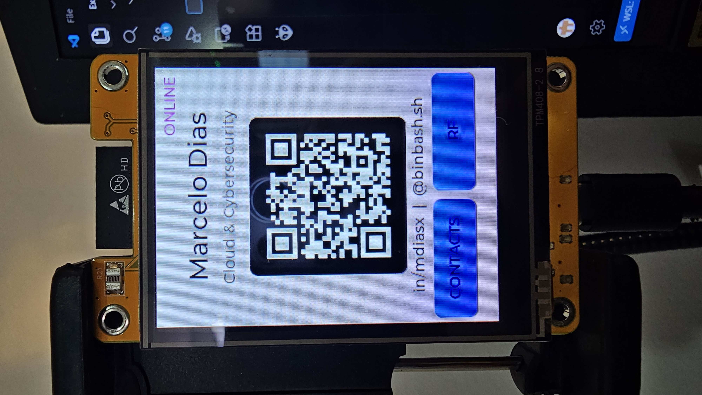
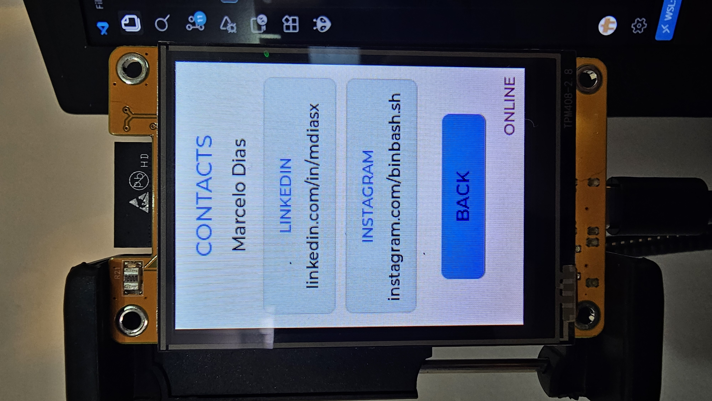
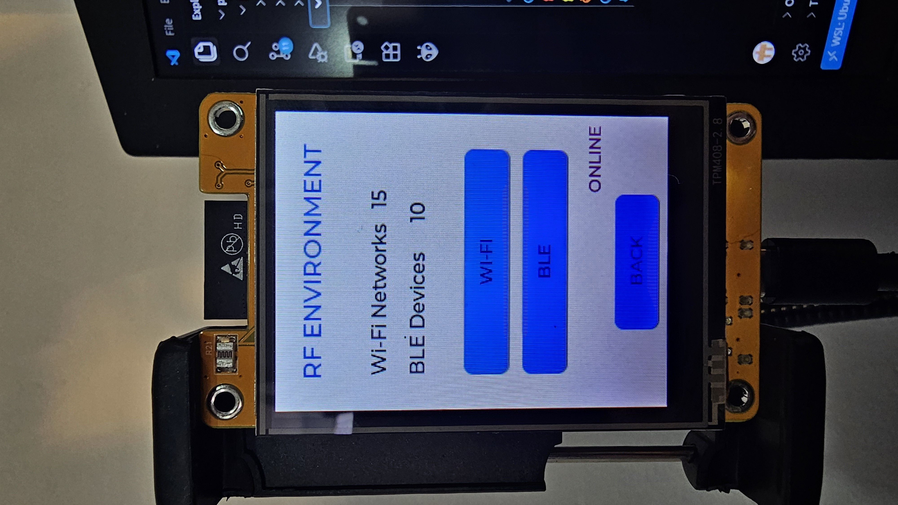
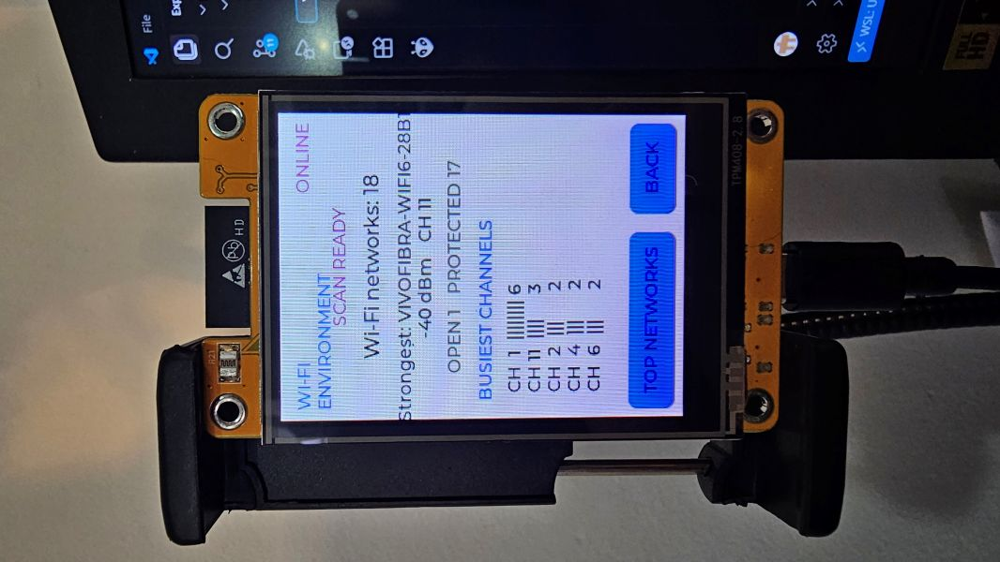
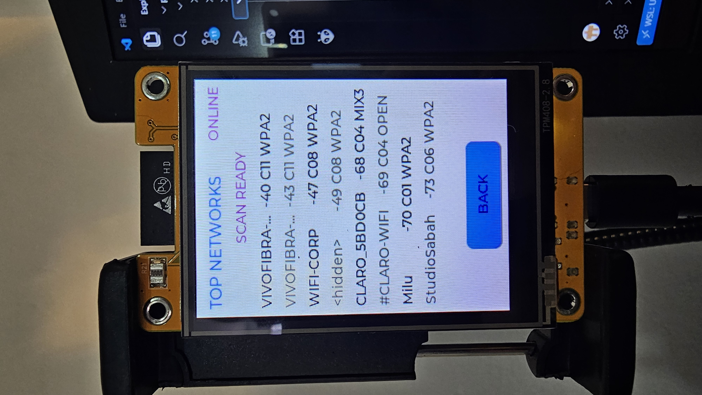
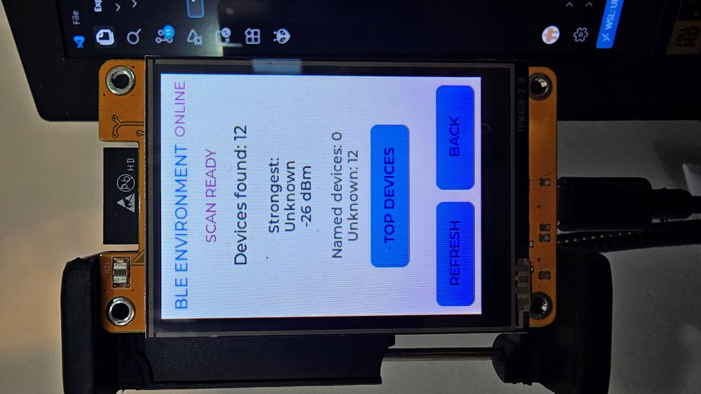
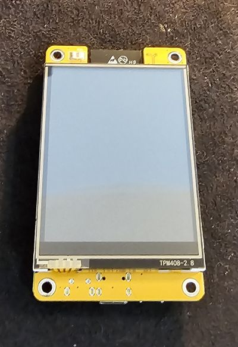
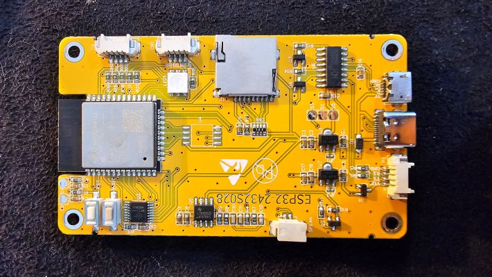
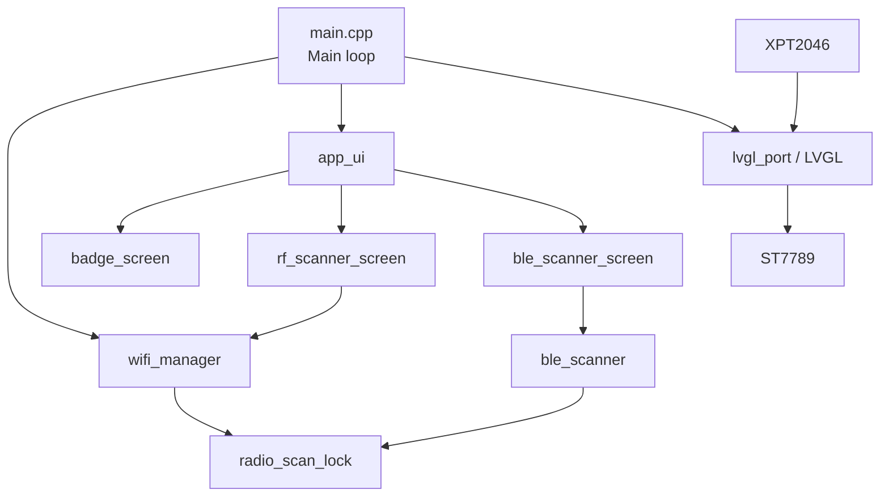

# YellowCard

[](https://platformio.org/)
[](https://www.espressif.com/en/products/socs/esp32)
[](https://www.arduino.cc/)
[](https://lvgl.io/)
[](LICENSE)
[](CHANGELOG.md)

YellowCard is an ESP32 Cheap Yellow Display (CYD) wearable cybersecurity badge
with a touchscreen contact card, local QR code, multi-Wi-Fi connectivity, and
passive Wi-Fi and BLE environment discovery.

## Overview

YellowCard transforms a compact ESP32 display board into an interactive badge
for cybersecurity conferences, labs, classrooms, and maker projects. It can be
used as a professional contact card, a simple 2.4 GHz RF visualization tool,
and an embedded security learning platform. The badge remains usable when no
known Wi-Fi network is available.

The v0.4.0 firmware has been validated on physical hardware. Discovery
features are deliberately passive: YellowCard does not capture traffic,
inject packets, deauthenticate clients, or connect to unknown devices.

## YellowCard in action

YellowCard running on a validated ESP32-2432S028 / Cheap Yellow Display with ST7789 display and XPT2046 resistive touchscreen.

### Interactive badge



Personal badge with QR code, online status and direct navigation to contact and RF functions.

### Contacts



Dedicated contact screen with LinkedIn and Instagram information.

### RF environment



Unified RF menu providing access to passive Wi-Fi and BLE discovery.

### Wi-Fi environment



Passive 2.4 GHz Wi-Fi scan showing network count, strongest access point, security summary and busiest channels.

### Top Wi-Fi networks



The eight strongest detected Wi-Fi networks, including RSSI, channel and security type.

### BLE environment



Passive BLE advertisement discovery with device count, strongest signal and quick access to the strongest detected devices.

## Features

### Interactive Badge

- Name and professional title in a portrait 240×320 interface.
- QR code generated locally by LVGL.
- Dedicated Contacts screen with LinkedIn and Instagram details.
- Resistive touchscreen navigation and discreet online/offline indication.

### Multi-Wi-Fi

- Up to four locally configured known networks.
- Explicit priority is the primary selection criterion; RSSI breaks ties.
- Non-blocking scanning and connection state machine.
- Connection timeout and periodic reconnection without rebooting.
- Complete offline operation when credentials or known networks are absent.
- Credentials remain in a Git-ignored local header.

### Wi-Fi RF Environment Scanner

- Passive 2.4 GHz discovery through the normal `WiFi.scanNetworks()` API.
- Stores at most 16 strongest access points and displays at most 8.
- Shows SSID, RSSI, channel, and summarized security type.
- Reports open/protected totals and occupied-channel distribution.
- Scan snapshots are held only in RAM.

It provides **no packet capture, monitor mode, deauthentication, packet
injection, or unauthorized network association**.

### BLE Scanner

- Passive BLE advertisement discovery on explicit user request.
- Stores at most 16 strongest devices and displays at most 8.
- Shows a sanitized device name when available and RSSI.
- Does not retain raw advertisement or manufacturer/service payloads.
- No GATT connection, pairing, service enumeration, spoofing, or persistence.

### Offline-first Behavior

Badge, Contacts, QR, Wi-Fi RF, and BLE screens remain available without an
internet connection. With no `wifi_secrets.h`, the firmware builds with a safe
zero-network fallback and starts in offline mode.

## Screens

- **Badge** — identity, title, QR code, contact and RF navigation.
- **Contacts** — LinkedIn and Instagram details.
- **RF Environment** — entry point and latest Wi-Fi/BLE discovery totals.
- **Wi-Fi Environment** — strongest AP, security totals, and channel summary.
- **Top Wi-Fi Networks** — up to eight networks sorted by RSSI.
- **BLE Environment** — discovery state, strongest device, and name totals.
- **Top BLE Devices** — up to eight devices sorted by RSSI.

Screenshot placeholders are reserved at:

- `docs/images/badge.jpg`
- `docs/images/wifi-rf.jpg`
- `docs/images/ble.jpg`

These images are not included yet. See [hardware documentation](docs/hardware.md)
and [architecture documentation](docs/architecture.md) for technical details.

## Hardware

| Component | Validated configuration |
| --- | --- |
| Board | ESP32 Cheap Yellow Display / ESP32-2432S028, 2-USB style variant |
| MCU | ESP32-D0WD-V3 |
| CPU | Dual-core, 240 MHz |
| Flash | 4 MB |
| PSRAM | None |
| Display | ST7789, 240×320, RGB565 |
| Touch | XPT2046 resistive controller |
| USB serial | CH340 |
| Wi-Fi | 2.4 GHz 802.11 b/g/n |
| Bluetooth | ESP32 Bluetooth/BLE radio; NimBLE observer role used |

YellowCard v0.4.0 was validated on an ESP32-2432S028 Cheap Yellow Display
variant with ST7789 display and XPT2046 resistive touchscreen.

<p align="center">
  
  
</p>

See [Hardware documentation](docs/hardware.md) for the validated board,
pinout and CYD variant notes.

Cheap Yellow Display variants are not electrically or functionally identical.
This repository is validated specifically against the **ST7789 / 2-USB style
variant** used during development. Other ESP32-2432S028 boards may use an
ILI9341 controller or different wiring and require display configuration
changes. Verify your board before uploading.

### Display Pinout

| Signal | GPIO |
| --- | ---: |
| MISO | 12 |
| MOSI | 13 |
| SCLK | 14 |
| CS | 15 |
| DC | 2 |
| RST | -1 (not connected/software reset) |
| Backlight | 21, active HIGH |

### Touch Pinout

| Signal | GPIO |
| --- | ---: |
| CLK | 25 |
| MOSI | 32 |
| MISO | 39 |
| CS | 33 |
| IRQ | 36 |

See [docs/hardware.md](docs/hardware.md) before adapting the project to another
CYD revision.

## Software Architecture

The main loop updates the Wi-Fi state machine, UI/scanner state, and LVGL
continuously. Display and touch are owned by `lvgl_port`; Wi-Fi and BLE scans
share a small serialization lock.



| Module | Responsibility |
| --- | --- |
| `main.cpp` | Hardware probe, initialization, and cooperative main loop |
| `app_ui` | Creates screens and forwards periodic/status updates |
| `badge_screen` | Badge, Contacts, QR, and RF entry navigation |
| `wifi_manager` | Known-network connection and shared Wi-Fi scan snapshot |
| `rf_scanner_screen` | RF overview and Wi-Fi result presentation |
| `ble_scanner` | Passive NimBLE scan lifecycle and fixed-size snapshot |
| `ble_scanner_screen` | BLE overview and strongest-device presentation |
| `radio_scan_lock` | Prevents concurrent Wi-Fi and BLE discovery scans |
| `lvgl_port` | ST7789 flush, XPT2046 input, and partial draw buffer |

More detail is available in [docs/architecture.md](docs/architecture.md).

## Radio Coexistence

The classic ESP32 uses shared 2.4 GHz radio resources for Wi-Fi and BLE.
YellowCard serializes explicit Wi-Fi and BLE discovery through
`radio_scan_lock`: a scanner defers while the other owns the lock. It does not
intentionally disconnect an established known Wi-Fi connection for BLE.

Before NimBLE initialization, the firmware explicitly applies and verifies
`WIFI_PS_MIN_MODEM`. This power-save mode is required by the validated
Wi-Fi/BLE coexistence path. Details are in
[docs/architecture.md](docs/architecture.md#radio-coexistence).

## Memory and Resource Usage

Validated v0.4.0 build values:

| Resource | Usage |
| --- | ---: |
| Static RAM | 96,452 / 327,680 bytes (29.4%) |
| Application flash | 1,219,609 / 3,145,728 bytes (38.8%) |
| `firmware.bin` | 1,226,192 bytes |

Observed physical-device runtime values after NimBLE initialization were
approximately **115 KB free heap** and **100 KB minimum free heap**. These are
test observations, not guarantees; radio conditions, framework versions, and
future changes can alter them.

The target has no PSRAM. LVGL therefore uses a 240×20-line RGB565 partial draw
buffer (9,600 bytes), not a full framebuffer. The Arduino `huge_app.csv`
partition scheme provides a 3,145,728-byte application partition. It trades
away OTA slots; v0.4.0 does not support OTA updates.

## Installation

### Requirements

- Git.
- Visual Studio Code with the PlatformIO extension, or PlatformIO Core CLI.
- A data-capable USB cable.
- CH340 serial support on the host operating system.

Clone using the repository URL after it has been published:

```sh
git clone <REPOSITORY_URL>
cd yellowcard
```

Build without uploading:

```sh
pio run -e esp32dev
```

Upload explicitly:

```sh
pio run -e esp32dev -t upload
```

Monitor serial output:

```sh
pio device monitor --baud 115200
```

Use `pio device list` to identify the board's serial device. If multiple ports
are present, pass the selected port with `--upload-port` or `--port` as
appropriate. See [docs/installation.md](docs/installation.md).

## Wi-Fi Configuration

The public project builds without Wi-Fi credentials. To enable known-network
connection locally, copy the template:

```sh
cp include/wifi_secrets.example.h include/wifi_secrets.h
```

Then replace placeholders only in the ignored local file:

```cpp
constexpr WifiNetwork kKnownWifiNetworks[] = {
    {"YOUR_WIFI_SSID_1", "YOUR_WIFI_PASSWORD_1", 100},
    {"YOUR_WIFI_SSID_2", "YOUR_WIFI_PASSWORD_2", 75},
};
```

Higher numeric priority wins; RSSI is used only when priorities match. Keep no
more than four entries. `include/wifi_secrets.h` is ignored by Git and must
never be committed. See
[docs/wifi-configuration.md](docs/wifi-configuration.md).

## QR and Personalization

Badge identity strings and the QR contact URL are defined near the top of
[`src/badge_screen.cpp`](src/badge_screen.cpp). The current public URL is:

<https://tecnocorp.com.br/marcelo>

Replace `kQrContactUrl`, the name, title, and short contact labels with your own
public details. The QR code is generated locally; no image asset or remote QR
service is used.

## Build Configuration

[`platformio.ini`](platformio.ini) pins the validated libraries and defines the
ST7789 display wiring, BGR color order, 40 MHz display SPI frequency, LVGL
configuration, observer-only NimBLE roles, and optional scanner debug flags.
The selected partition scheme is the framework-provided `huge_app.csv`.

TFT_eSPI may emit this warning during compilation:

```text
TOUCH_CS pin not defined, TFT_eSPI touch functions will not be available
```

This is expected for the validated configuration. TFT_eSPI handles only the
display; touch is handled independently by `XPT2046_Touchscreen` on its own SPI
bus and CS pin.

## Usage

1. Power the board and watch the hardware probe on the 115200-baud serial log.
2. If local networks are configured, YellowCard scans and connects to the best
   available known network; otherwise it stays offline.
3. Use the Badge screen to show the QR contact page.
4. Tap **CONTACTS** to show social links and **BACK** to return.
5. Tap **RF**, then **WI-FI**, to refresh RF metadata and inspect top networks.
6. Return to RF Environment and tap **BLE** to start a five-second passive scan.
7. Use the screen-specific **BACK** buttons to return to the Badge.

## Security Model

- Discovery is passive and uses standard Wi-Fi scan/BLE observer APIs.
- No traffic interception or packet payload collection.
- No monitor mode, injection, deauthentication, or beacon emulation.
- No credential collection.
- No automatic association with unknown Wi-Fi networks.
- Known Wi-Fi credentials exist only in a local Git-ignored header.
- Scan results are ephemeral RAM snapshots.
- No telemetry, cloud backend, API client, or remote write operation.

Use YellowCard responsibly and comply with local law, venue rules, and network
policies. See [SECURITY.md](SECURITY.md) and [docs/security.md](docs/security.md).

## Privacy

Wi-Fi discovery displays SSIDs and radio metadata already broadcast over the
air. BLE discovery stores sanitized names, RSSI, and a volatile identity hash
used only to deduplicate the current snapshot; it does not display full MAC
addresses or retain advertisement payloads. There is no historical database or
external transmission. Scan data exists only in RAM and is cleared by reboot.

## Troubleshooting

Quick checks:

- **Device not detected / upload error:** use a data cable, check CH340 support,
  close other serial monitors, and run `pio device list`.
- **Blank or incorrect display:** verify this is the ST7789/2-USB variant and
  confirm the configured display pins and BGR order.
- **Touch does not respond:** verify the XPT2046 wiring; do not assume all CYD
  variants use the same SPI bus or calibration.
- **Wi-Fi remains offline:** confirm the local header exists, contains at most
  four valid entries, and that a configured 2.4 GHz network is available.
- **BLE scan is deferred:** wait for any Wi-Fi discovery scan to finish; scans
  are intentionally serialized.
- **`TOUCH_CS` warning:** expected; TFT_eSPI touch support is not used.

Detailed CH340, WSL2/usbipd, display, touch, Wi-Fi, BLE, and coexistence steps
are in [docs/troubleshooting.md](docs/troubleshooting.md).

## Known Limitations

- Classic ESP32 with 4 MB flash and no PSRAM.
- 2.4 GHz only; no 5 GHz Wi-Fi discovery.
- CYD variants may use different display controllers or pin mappings.
- Passive discovery only, with 16 stored and 8 displayed entries per scanner.
- Wi-Fi and BLE discovery are serialized and may temporarily contend with an
  active Wi-Fi connection for shared radio time.
- `huge_app.csv` disables OTA partition redundancy.
- Resistive touch requires physical pressure and board-specific calibration.

## Roadmap

Possible future work, not committed functionality:

- Presentation mode.
- Theme and badge personalization options.
- On-device configuration UI without committing credentials.
- Battery information where supported by the specific hardware revision.
- Additional passive RF visualizations within the documented security model.

## Project History

- **F0** — hardware probe, ST7789 display, and XPT2046 validation.
- **F1** — LVGL foundation with a partial framebuffer.
- **F2** — Badge, Contacts, and local QR code.
- **F3** — multi-Wi-Fi selection and offline fallback.
- **F4** — passive Wi-Fi RF environment scanner.
- **F4-B / v0.4.0** — passive BLE scanner and Wi-Fi/BLE coexistence stability.

See [CHANGELOG.md](CHANGELOG.md) for release notes.

## Contributing

Contributions are welcome when they preserve the passive, defensive scope.
Read [CONTRIBUTING.md](CONTRIBUTING.md) before opening a pull request.

## License

YellowCard is available under the [MIT License](LICENSE).

## Author

**Marcelo Dias**

- LinkedIn: <https://www.linkedin.com/in/mdiasx/>
- Instagram: <https://www.instagram.com/binbash.sh>
- Website: <https://tecnocorp.com.br/marcelo>
