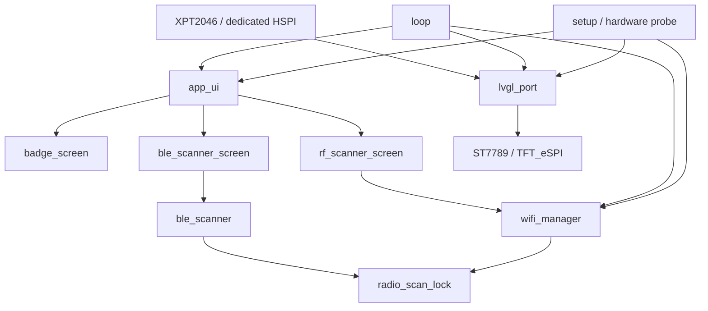

# Software Architecture

YellowCard uses a small cooperative architecture suitable for a classic ESP32
without PSRAM. The Arduino `loop()` continuously advances three areas:

1. `WifiManager::update()` advances Wi-Fi scan, connect, online, and reconnect
   states.
2. `AppUi::update()` advances BLE scanning and refreshes RF/BLE screen data.
3. `LvglPort::runOnce()` runs `lv_timer_handler()` so display rendering and
   touch input remain responsive.

No network or scanner operation intentionally blocks the LVGL loop.



## Module Responsibilities

### `src/main.cpp`

Prints the hardware probe, initializes LVGL/UI/Wi-Fi, and owns the cooperative
main loop. A Wi-Fi status callback propagates ONLINE/OFFLINE state to the UI.

### `src/lvgl_port.cpp`

Owns the TFT_eSPI display instance, the dedicated XPT2046 SPI instance, LVGL
display/input drivers, and the 240×20-line RGB565 draw buffer. The LVGL input
callback is the single owner of `touch.touched()` and `touch.getPoint()`.

### `src/app_ui.cpp`

Creates Badge, RF, and BLE screens. Its periodic update advances BLE state and
updates RF/BLE labels only when snapshots or state change.

### `src/badge_screen.cpp`

Builds the Badge and Contacts screens, generates the QR code locally, presents
network state, and routes the RF button to the RF overview.

### `src/wifi_manager.cpp`

Uses one asynchronous scan both for known-network selection and RF display
data. It maintains a fixed snapshot of at most 16 strongest APs plus counts for
channels 1–13 and open/protected networks. Known-network priority is primary;
RSSI is the tie-breaker. Results are deleted from the Arduino Wi-Fi scan buffer
only after processing.

### `src/rf_scanner_screen.cpp`

Presents combined RF totals, Wi-Fi overview, channel summary, and up to eight
strongest networks. It requests a scan through `WifiManager`; it does not
create an independent Wi-Fi scanner.

### `src/ble_scanner.cpp`

Initializes NimBLE when first requested, configures passive scanning, and uses
callbacks to populate a fixed 16-device snapshot. `setMaxResults(0)` prevents
NimBLE from retaining a second result collection. A volatile identity hash
deduplicates advertisers during the current snapshot; no full address or raw
advertisement payload is retained.

### `src/ble_scanner_screen.cpp`

Requests a five-second BLE scan when opened, renders state and aggregate
counts, and displays up to eight strongest devices. Leaving the BLE module
stops an active scan through the scanner state machine.

### `src/radio_scan_lock.cpp`

Provides a small single-owner lock with `None`, `Wifi`, and `Ble` owners. It is
not a general-purpose RTOS mutex; it serializes explicit scan lifecycles in the
cooperative application state machines.

## Data Lifetimes

- Badge and UI objects live for the firmware session.
- Wi-Fi and BLE snapshots live only in static RAM.
- New scans replace the previous snapshot.
- No scan result is written to NVS, filesystem, or an external service.
- A reboot clears all discovered radio data.

## Radio Coexistence

Wi-Fi and BLE share the classic ESP32 2.4 GHz radio. Before starting a scan,
each scanner verifies that the other scanner does not own `radio_scan_lock`.
If busy, work is deferred to a later loop iteration. The Wi-Fi manager also
reports whether it is scanning or connecting so BLE can defer cleanly.

The validated coexistence path requires Wi-Fi station mode to be initialized
and power saving to be `WIFI_PS_MIN_MODEM` before NimBLE initialization.
`ble_scanner` calls `esp_wifi_set_ps(WIFI_PS_MIN_MODEM)` and verifies it with
`esp_wifi_get_ps()`. Driver-not-ready results are retried by the state machine
for a bounded period without blocking LVGL. The firmware does not switch back
to `WIFI_PS_NONE` and does not intentionally disconnect a known Wi-Fi network
for BLE scanning.

## Memory Strategy

- No full-screen framebuffer and no PSRAM.
- LVGL draw buffer: 240 × 20 × 2 bytes = 9,600 bytes.
- LVGL internal heap: 32 KB, configured in `include/lv_conf.h`.
- Wi-Fi AP storage: fixed array of 16 entries.
- BLE storage: fixed array of 16 entries.
- UI lists display at most eight results.
- Scanner payloads and historical collections are not retained.

## Debug Flags

`platformio.ini` defines these as disabled for public builds:

```ini
-D YELLOWCARD_WIFI_AP_DEBUG=0
-D YELLOWCARD_BLE_DEVICE_DEBUG=0
```

Setting a flag to `1` enables detailed discovery logging. Treat those logs as
potentially sensitive because nearby SSIDs or device names may appear. Never
attach unreviewed logs to a public issue.
